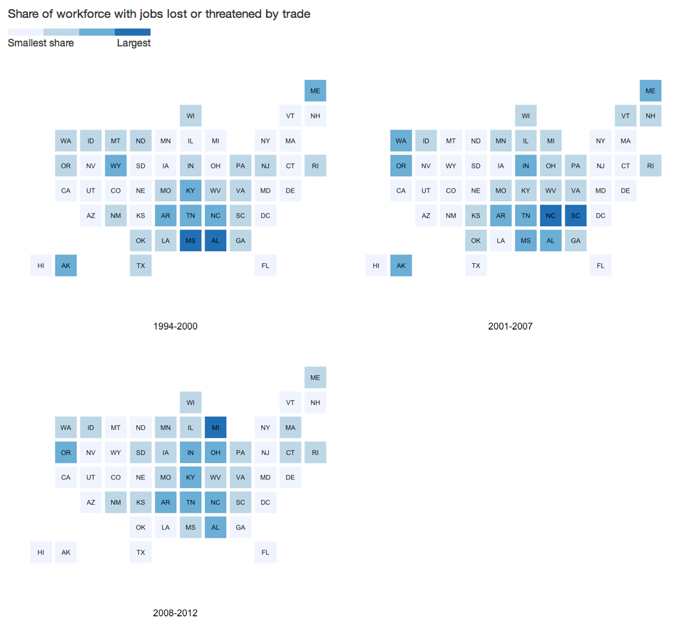

<!-- output: html_document -->

statebins - U.S. State Cartogram Heatmaps in R; an alternative to choropleth maps for USA States

The following functions are implemented:

- `statebins` - creates "statebin" charts in the style of http://bit.ly/statebins - This version uses discrete `RColorBrewer` scales, binned by the "breaks" parameter.
- `statebins_continuous` - creates "statebin" charts in the style of http://bit.ly/statebins - This version uses a continuous scale based on `RColorBrewer` scales (passing in a 6 element `RColorBrewer` palette to `scale_fill_gradientn`).
- `statebins_manual` - creates "statebin" charts using manually specified colors in a column

### TODO

- The current version is usable, but I think the plot margins and the legends need work
- Apply algorithm to switch to light-on-dark depending on the background tile color 

### News

- Version `1.2.1` released - Added support for `PR`/`Puerto Rico`[[1](https://github.com/hrbrmstr/statebins/issues/2)] and fixed a bug[[2](https://github.com/hrbrmstr/statebins/issues/3)] when using anything but a `data.frame` as input
- Version `1.1.0` released - `statebins_manual()` for manual placement of colors and moving of AK in support of a [pull request](https://github.com/hrbrmstr/statebins/pull/1) by [hansthompson](https://github.com/hansthompson)
- Version `1.0.0` released

### Installation

```{r eval=FALSE}
devtools::install_github("hrbrmstr/statebins")
```

```{r echo=FALSE, message=FALSE, warning=FALSE, error=FALSE}
options(width=120)
```

### Usage

All of the following examples use the [WaPo data](http://www.washingtonpost.com/wp-srv/special/business/states-most-threatened-by-trade/states.csv?cache=1). It looks like the columns they use are scaled data and I didn't take the time to figure out what they did, so the final figure just mimics their output (including the non-annotated legend).

```{r message=FALSE}
library(statebins)

# current verison
packageVersion("statebins")

# the original wapo data

dat <- read.csv("http://www.washingtonpost.com/wp-srv/special/business/states-most-threatened-by-trade/states.csv?cache=1", stringsAsFactors=FALSE)

gg <- statebins(dat, "state", "avgshare94_00", breaks=4, 
                labels=c("0-1", "1-2", "2-3", "3-4"),
                legend_title="Share of workforce with jobs lost or threatened by trade", font_size=3, 
                brewer_pal="Blues", text_color="black", 
                plot_title="1994-2000", title_position="bottom")

gg

# continuous scale, legend on top

gg2 <- statebins_continuous(dat, "state", "avgshare01_07",
                            legend_title="Share of workforce with jobs lost or threatened by trade", legend_position="top",
                            brewer_pal="OrRd", text_color="black", font_size=3, 
                            plot_title="2001-2007", title_position="bottom")

gg2

# continuous scale, no legend

gg3 <- statebins_continuous(dat, "state", "avgshare08_12",
                            legend_title="States", legend_position="none",
                            brewer_pal="Purples", text_color="black", font_size=3, 
                            plot_title="2008-2012", title_position="bottom")

gg3

# mortality (only to show PR and using a data.table)
# from: http://www.cdc.gov/nchs/fastats/state-and-territorial-data.htm

dat <- data.table::fread("http://dds.ec/data/deaths.csv")
statebins_continuous(dat, "state", "death_rate", legend_title="Per 100K pop",
                    plot_title="Mortality Rate (2010)")

# fertility (only to show tbl_dt)

dat <- dplyr::tbl_dt(dat)
statebins_continuous(dat, "state", "fertility_rate", legend_title="Per 100K pop", 
                     plot_title="Fertility Rate (2010)", brewer_pal="PuBuGn")

# manual - perhaps good for elections?

library(httr)
library(dplyr)
election_2012 <- GET("https://raw.githubusercontent.com/hrbrmstr/statebins/master/tmp/election2012.csv")
results <- read.csv(textConnection(content(election_2012, as="text")), header=TRUE, stringsAsFactors=FALSE)
results <- results %>% mutate(color=ifelse(is.na(Obama), "#2166ac", "#b2182b")) %>% select(state, color)
results %>% statebins_manual(font_size=4, text_color = "white", labels=c("Romney", "Obama"), legend_position="right", legend_title="Winner")

# or, more like the one in the WaPo article; i might be picking the wrong columns here. it's just for an example

sb <- function(col, title) {
  statebins(dat, "state",col, brewer_pal="Blues", text_color="black", legend_position="none", font_size=3, plot_title=title, breaks=4, labels=1:4)
}
```

```{r eval=FALSE}
# cheating and using <table> to arrange them below and also making a WaPo-like legend, 
# since mucking with grid graphics margins/padding was not an option time-wise at the moment

sb("avgshare94_00", "1994-2000")
sb("avgshare01_07", "2001-2007")
sb("avgshare08_12", "2008-2012")
```

<!-- uncomment the following and add backticks where appropriate and remove the reference to -->
<!-- the static image when the rmarkdown output is HTML and this will work fine. github does not render the markdown properly -->
<!-- 
<span style="font-size:17px; color:#333;">Share of workforce with jobs lost or threatened by trade</span><br/>

<table style="width:200px" cellpadding=0, cellspacing=0><tr style="line-height:10px">
<td width="25%" style="background:#EFF3FF;">&nbsp;</td>
<td width="25%" style="background:#BDD7E7;">&nbsp;</td>
<td width="25%" style="background:#6BAED6;">&nbsp;</td>
<td width="25%" style="background:#2171B5;">&nbsp;</td></tr>
<tr><td colspan=2 align="left" style="font-size:14px">Smallest share</td><td colspan=2 align="right" style="font-size:14px">Largest</td></tr>
</table>

<table width="100%" cellpadding="0" cellspacing="0">
<tr><td width="50%">

{r f1994, echo=FALSE, fig.width=6, fig.height=5}
sb("avgshare94_00", "1994-2000")

</td><td width="50%">

{r f2001, echo=FALSE, fig.width=6, fig.height=5, results='asis'}
sb("avgshare01_07", "2001-2007")

</td></tr><tr><td width="50%">

{r f2008, echo=FALSE, fig.width=6, fig.height=5, results='asis'}
sb("avgshare08_12", "2008-2012")

</td><td width="50%"> &nbsp; </td></tr></table>

-->

<center></center>

And, we'll throw in a gratuitous animation for good measure:

```{r eval=FALSE}
# data set from StatsAmerica - http://www.statsamerica.org/profiles/sip_index.html

# median household income from the ACS survey
miacs <- read.csv("http://dds.ec/data/median-income-acs.csv", header=TRUE, stringsAsFactors=FALSE)

# generate frames based on year
sapply(unique(miacs$year), function(year) {
  
  png(file=sprintf("tmp/household%d.png", year),
      type="quartz", antialias="subpixel", width=800, height=600)
  
  rng <- floor(range(miacs[miacs$year==year,]$mh_inc))
  
  ggtmp <- statebins(miacs[miacs$year==year,], "state", "mh_inc",
                   legend_title="States", legend_position="none",
                   brewer_pal="Greens", text_color="black", font_size=3,
                   plot_title=sprintf("Median Household Income (ACS) %d\n$%s - $%s", year, comma(rng[1]), comma(rng[2])), title_position="top")
  
  print(ggtmp)
  
  dev.off()
  
})

# animate them with ImageMagick
system("convert -background white -alpha remove -layers OptimizePlus -delay 150 tmp/*.png -loop 1 tmp/household.gif")
```

<center></embed></center>

### Test Results

```{r}
library(statebins)
library(testthat)

date()

test_dir("tests/")
```

