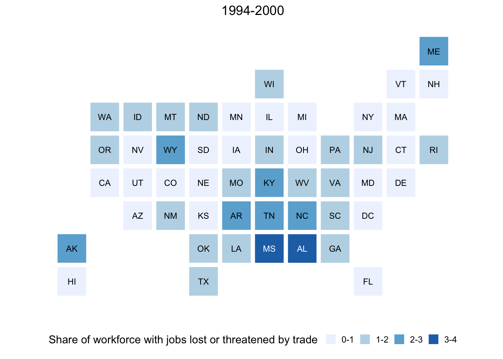
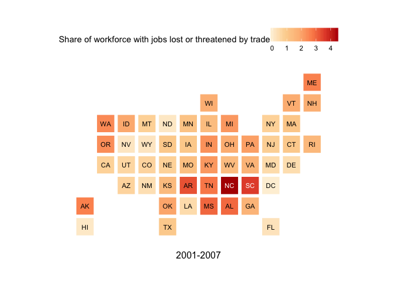
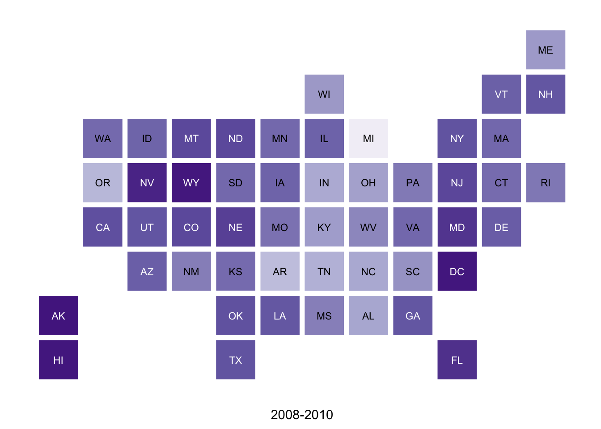
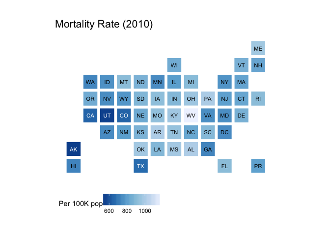
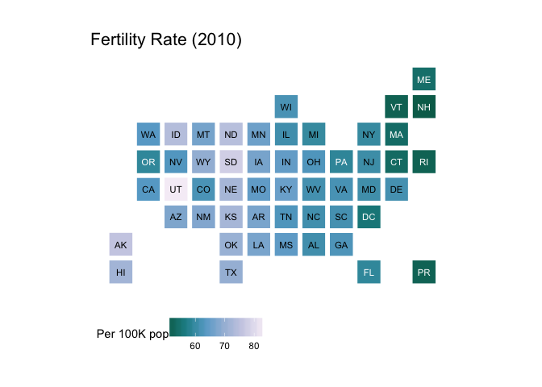
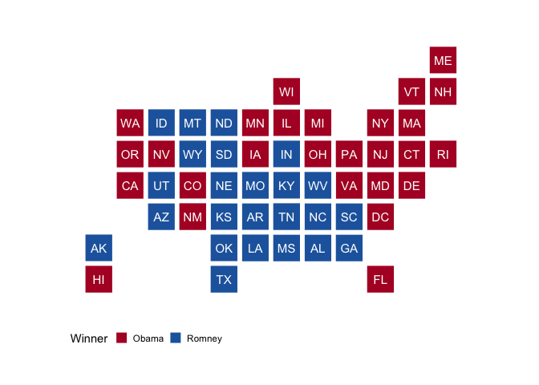
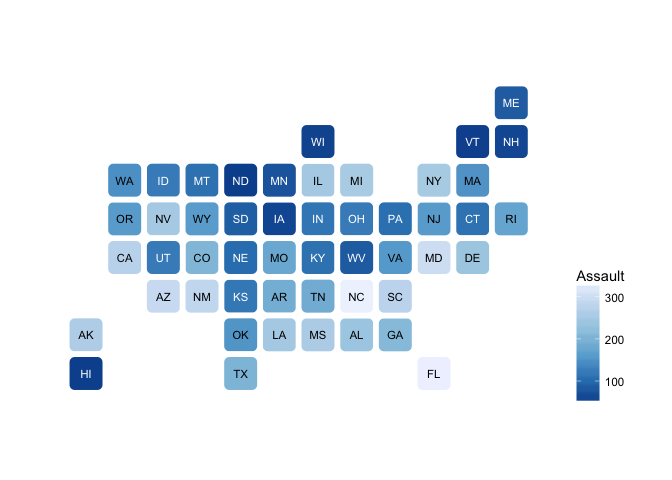
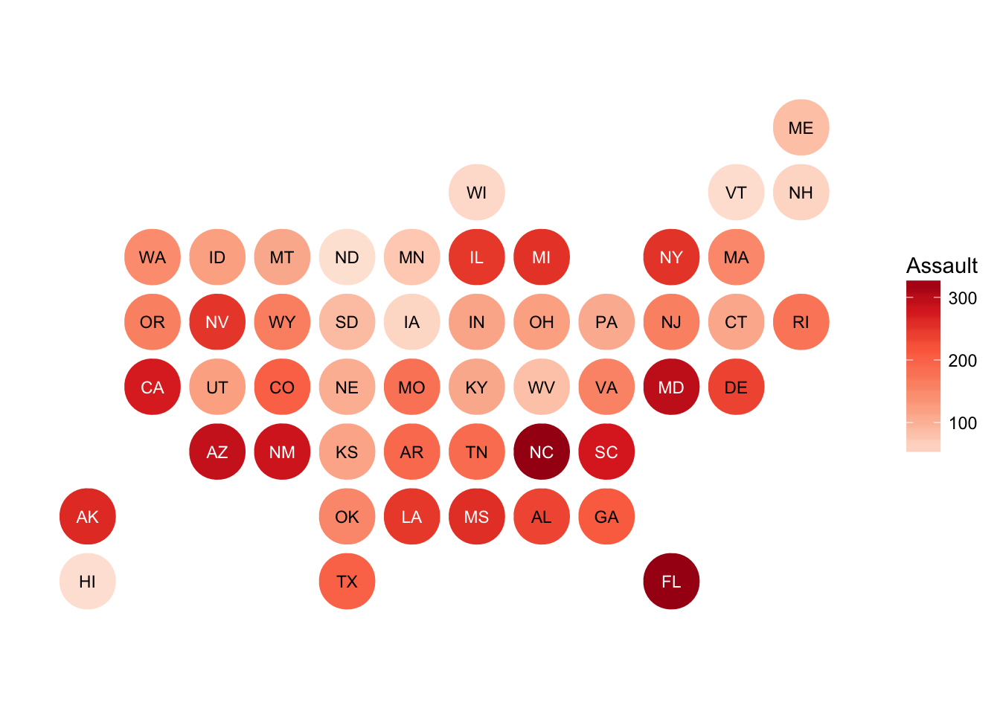
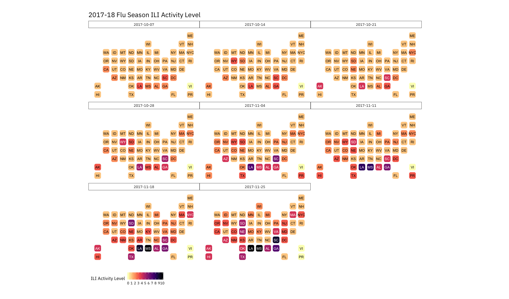
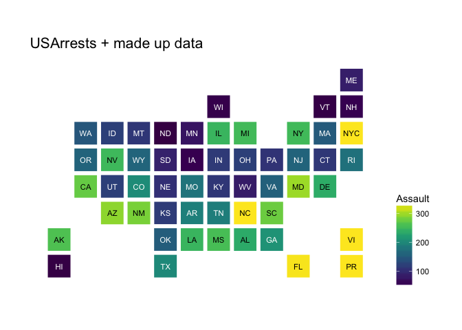

[](https://travis-ci.org/hrbrmstr/statebins)

# statebins

Create ‘U.S.’ Uniform Square State Cartogram Heatmaps

## What’s in the tin?

The following functions are implemented:

  - `statebins`: Creates “statebin” charts in the style of
    <http://bit.ly/statebins>
  - `geom_statebins`: A statebins Geom (WIP\!)
  - `theme_statebins`: Base statebins theme

## Installation

``` r
devtools::install_github("hrbrmstr/statebins")
```

## NOTE

Due to a number of things, this is dependent on the *development*
version of ggplot2 and now identifies that in the `DESCRIPTION`
metadata, *including* a `Remotes:` field (which will be removed when
this & ggplot2 hit CRAN).

## Usage

All of the following examples use the [WaPo
data](http://www.washingtonpost.com/wp-srv/special/business/states-most-threatened-by-trade/states.csv?cache=1).
It looks like the columns they use are scaled data and I didn’t take the
time to figure out what they did, so the final figure just mimics their
output (including the non-annotated legend).

``` r
library(statebins)
library(cdcfluview)
library(hrbrthemes)
library(tidyverse)

# current verison
packageVersion("statebins")
```

    ## [1] '2.0.0'

### The original wapo data

``` r
adat <- suppressMessages(read_csv(system.file("extdata", "wapostates.csv", package="statebins")))

mutate(
  adat, 
  share = cut(avgshare94_00, breaks = 4, labels = c("0-1", "1-2", "2-3", "3-4"))
) %>% 
  statebins(
    value_col = "share", 
    ggplot2_scale_function = scale_fill_brewer,
    name = "Share of workforce with jobs lost or threatened by trade"
  ) +
  labs(title = "1994-2000") +
  theme_statebins()
```



### Continuous scale, legend on top

``` r
statebins(
  adat, value_col = "avgshare01_07",
  name = "Share of workforce with jobs lost or threatened by trade",
  palette = "OrRd", direction = 1
) +
  labs(x="2001-2007") +
  theme_statebins(legend_position="top")
```



### Continuous scale, no legend

``` r
statebins(adat, value_col = "avgshare08_12", palette = "Purples") +
  labs(x="2008-2010") +
  theme_statebins(legend_position = "none") 
```



### Mortality data (has Puerto Rico)

``` r
# from: http://www.cdc.gov/nchs/fastats/state-and-territorial-data.htm

dat <- suppressMessages(read_csv(system.file("extdata", "deaths.csv", package="statebins")))

statebins(dat, value_col = "death_rate", name="Per 100K pop") +
  labs(title="Mortality Rate (2010)") +
  theme_statebins()
```



### Fertility data

``` r
statebins(dat, value_col="fertility_rate", name="Per 100K pop", palette="PuBuGn") +
  labs(title="Fertility Rate (2010)") +
  theme_statebins()
```



### Manual - perhaps good for elections?

``` r
election_2012 <- suppressMessages(read_csv(system.file("extdata", "election2012.csv", package="statebins")))

mutate(election_2012, value = ifelse(is.na(Obama), "Romney", "Obama")) %>% 
  statebins(
    font_size=4, dark_label = "white", light_label = "white",
    ggplot2_scale_function = scale_fill_manual,
    name = "Winner",
    values = c(Romney = "#2166ac", Obama = "#b2182b")
  ) +
  theme_statebins()
```



### Rounded rects\!

You can pass in a `grid::units()` call for the `radius` parameter.

Slight curves:

``` r
data(USArrests)

USArrests$state <- rownames(USArrests)
statebins(USArrests, value_col="Assault", name = "Assault", round=TRUE) +
  theme_statebins(legend_position="right")
```



Circles\!

``` r
statebins(USArrests, value_col="Assault", name = "Assault", round=TRUE, 
          radius=grid::unit(16, "pt"), palette="Reds", direction=1) +
  theme_statebins(legend_position="right")
```



### Geom

``` r
flu <- ili_weekly_activity_indicators(2017)

ggplot(flu, aes(state=statename, fill=activity_level)) +
  geom_statebins() +
  coord_equal() +
  viridis::scale_fill_viridis(
    name = "ILI Activity Level  ", limits=c(0,10), breaks=0:10, option = "magma", direction = -1
  ) +
  facet_wrap(~weekend) +
  labs(title="2017-18 Flu Season ILI Activity Level") +
  theme_statebins(base_family = font_ps) +
  theme(plot.title=element_text(size=16, hjust=0)) +
  theme(plot.margin = margin(30,30,30,30))
```



### All the “states”

`statebins` now has PR, VI & NYC (by name or abbreviation) so you can
use them, too:

``` r
library(statebins)
library(tidyverse)
library(viridis)

data(USArrests)

# make up some data for the example

rownames_to_column(USArrests, "state") %>%
  bind_rows(
    data_frame(
      state = c("Virgin Islands", "Puerto Rico", "New York City"),
      Murder = rep(mean(max(USArrests$Murder),3)),
      Assault = rep(mean(max(USArrests$Assault),3)),
      Rape = rep(mean(max(USArrests$Rape),3)),
      UrbanPop = c(93, 95, 100)
    )
  ) -> us_arrests

statebins(us_arrests, value_col="Assault",
          ggplot2_scale_function = viridis::scale_fill_viridis) +
  labs(title="USArrests + made up data") +
  theme_statebins("right")
```


