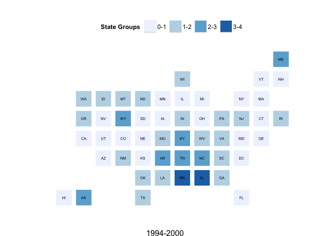
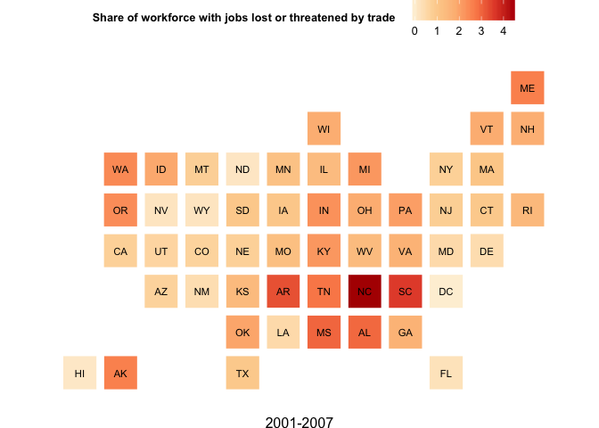
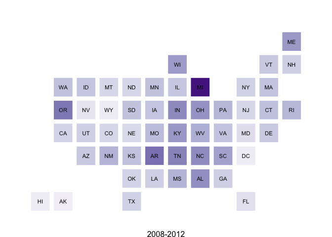
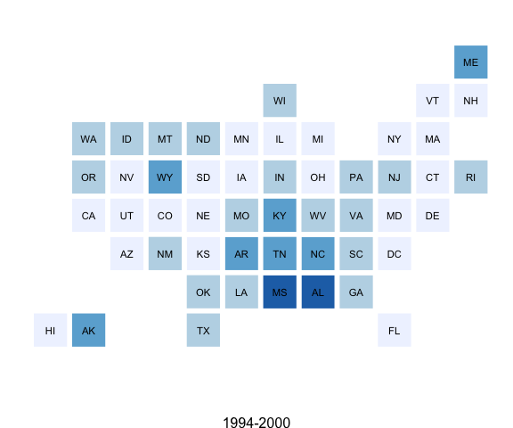
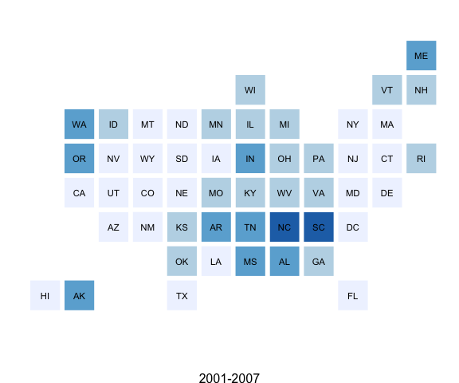
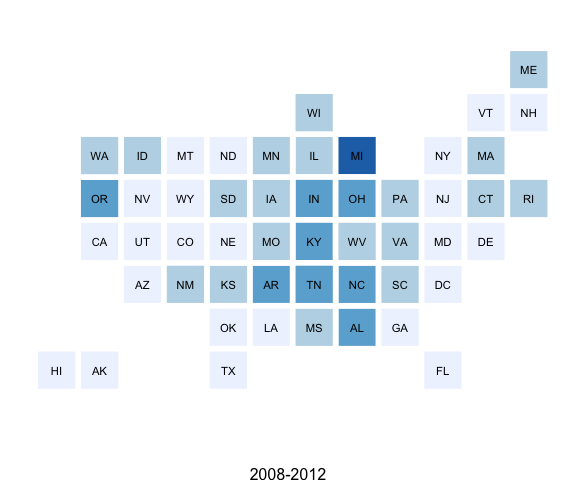

<!-- output: html_document -->

statebins is an alternative to choropleth maps for US States

The following functions are implemented:

-   `statebins` - creates "statebin" charts in the style of <http://bit.ly/statebins> - This version uses discrete `RColorBrewer` scales, binned by the "breaks" parameter.
-   `statebins_continuous` - creates "statebin" charts in the style of <http://bit.ly/statebins> - This version uses a continuous scale based on `RColorBrewer` scales (passing in a 6 element `RColorBrewer` palette to `scale_fill_gradientn`).

### TODO

-   The current version is usable, but I think the plot margins and the legends need work
-   Apply algorithm to switch to light-on-dark depending on the background tile color

### News

-   Version `1.0.0` released

### Installation

``` {.r}
devtools::install_github("hrbrmstr/statebins")
```

### Usage

All of the following examples use the [WaPo data](http://www.washingtonpost.com/wp-srv/special/business/states-most-threatened-by-trade/states.csv?cache=1). It looks like the colums they use are scaled data and I didn't take the time to figure out what they did, so the final figure just mimics their output (including the non-annotated legend).

``` {.r}
library(statebins)

# current verison
packageVersion("statebins")
```

    ## [1] '1.0'

``` {.r}
# the original wapo data

dat <- read.csv("http://www.washingtonpost.com/wp-srv/special/business/states-most-threatened-by-trade/states.csv?cache=1", stringsAsFactors=FALSE)

gg <- statebins(dat, "state", "avgshare94_00", breaks=4, 
                labels=c("0-1", "1-2", "2-3", "3-4"),
                legend_title="Share of workforce with jobs lost or threatened by trade", font_size=3, 
                brewer_pal="Blues", text_color="black", 
                plot_title="1994-2000", title_position="bottom")

gg
```



``` {.r}
# continuous scale, legend on top

gg2 <- statebins_continuous(dat, "state", "avgshare01_07",
                            legend_title="Share of workforce with jobs lost or threatened by trade", legend_position="top",
                            brewer_pal="OrRd", text_color="black", font_size=3, 
                            plot_title="2001-2007", title_position="bottom")

gg2
```



``` {.r}
# continuous scale, no legend

gg3 <- statebins_continuous(dat, "state", "avgshare08_12",
                            legend_title="States", legend_position="none",
                            brewer_pal="Purples", text_color="black", font_size=3, 
                            plot_title="2008-2012", title_position="bottom")

gg3
```



``` {.r}
# or, more like the one in the WaPo article; i might be picking the wrong columns here. it's just for an example

sb <- function(col, title) {
  statebins(dat, "state",col, brewer_pal="Blues", text_color="black", legend_position="none", font_size=3, plot_title=title, breaks=4, labels=1:4)
}
```

``` {.r}
# cheating and using <table> to arrange them below and also making a WaPo-like legend, 
# since mucking with grid graphics margins/padding was not an option time-wise at the moment

sb("avgshare94_00", "1994-2000")
sb("avgshare01_07", "2001-2007")
sb("avgshare08_12", "2008-2012")
```

<span style="font-size:17px; color:#333;">Share of workforce with jobs lost or threatened by trade</span><br/>

<!-- ok, so this is rly cheating, but it works :-) -->

<table style="width:200px" cellpadding=0, cellspacing=0><tr style="line-height:10px">
<td width="25%" style="background:#EFF3FF;">
 
</td>
<td width="25%" style="background:#BDD7E7;">
 
</td>
<td width="25%" style="background:#6BAED6;">
 
</td>
<td width="25%" style="background:#2171B5;">
 
</td></tr>
<tr><td colspan=2 align="left" style="font-size:14px">
Smallest share
</td><td colspan=2 align="right" style="font-size:14px">
Largest
</td></tr>
</table>

<table width="100%" cellpadding="0" cellspacing="0">
<tr><td width="50%">



</td><td width="50%">



</td></tr><tr><td width="50%">



</td><td width="50%"> 
 
</td></tr></table>

And, we'll throw in a gratuitous animation for good measure:

``` {.r}
# data set from StatsAmerica - http://www.statsamerica.org/profiles/sip_index.html

# median household income from the ACS survey
miacs <- read.csv("http://dds.ec/data/median-income-acs.csv", header=TRUE, stringsAsFactors=FALSE)

# generate frames based on year
sapply(unique(miacs$year), function(year) {
  
  png(file=sprintf("tmp/household%d.png", year),
      type="quartz", antialias="subpixel", width=800, height=600)
  
  rng <- floor(range(miacs[miacs$year==year,]$mh_inc))
  
  ggtmp <- statebins(miacs[miacs$year==year,], "state", "mh_inc",
                   legend_title="States", legend_position="none",
                   brewer_pal="Greens", text_color="black", font_size=3,
                   plot_title=sprintf("Median Household Income (ACS) %d\n$%s - $%s", year, comma(rng[1]), comma(rng[2])), title_position="top")
  
  print(ggtmp)
  
  dev.off()
  
})

# animate them with ImageMagick
system("convert -delay 100 -loop 1 tmp/house*.png tmp/household.mov")
```

<center><embed src="http://datadrivensecurity.info/dl/household.mov" width="800" height="600"></embed></center>

### Test Results

``` {.r}
library(statebins)
library(testthat)

date()
```

    ## [1] "Tue Aug 26 15:21:25 2014"

``` {.r}
test_dir("tests/")
```

    ## basic functionality :
